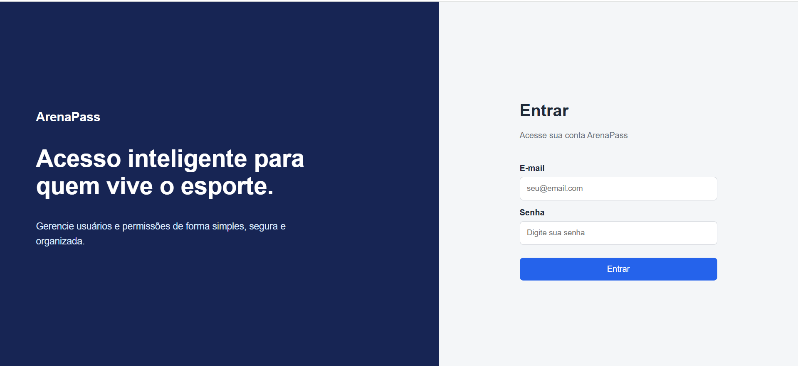
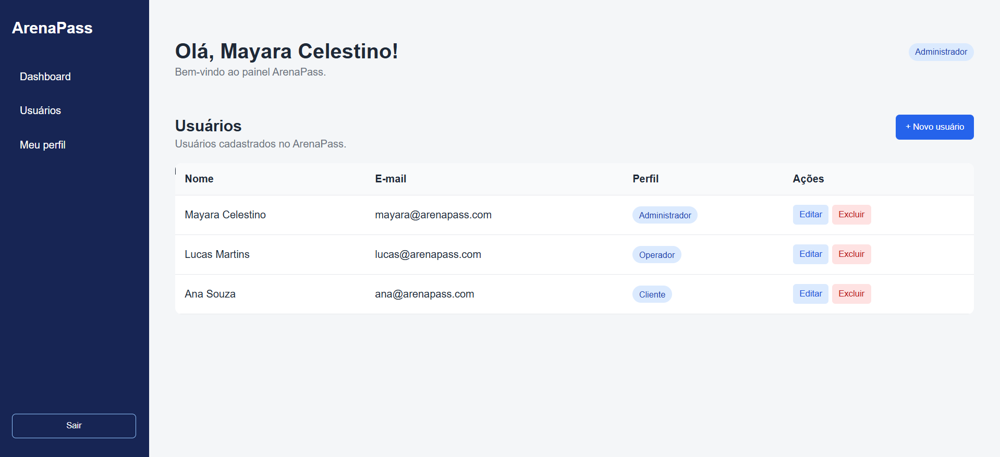
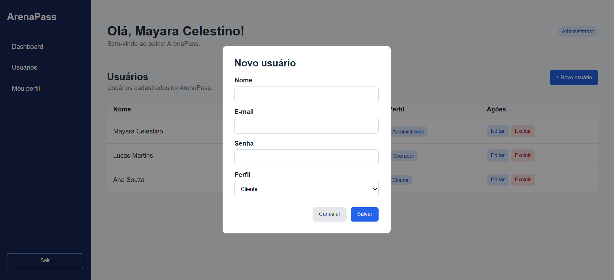
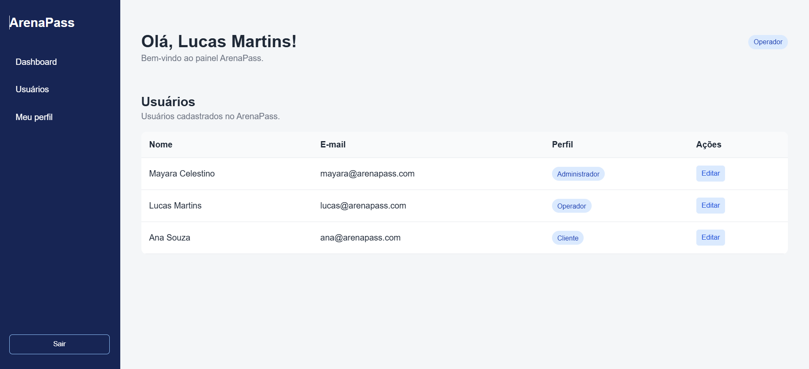
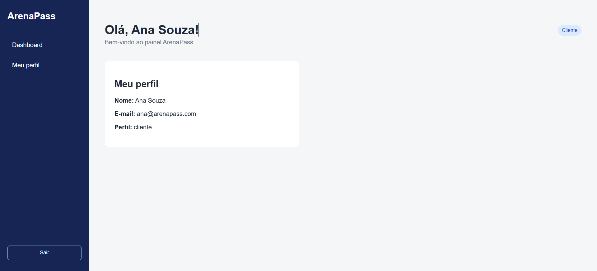
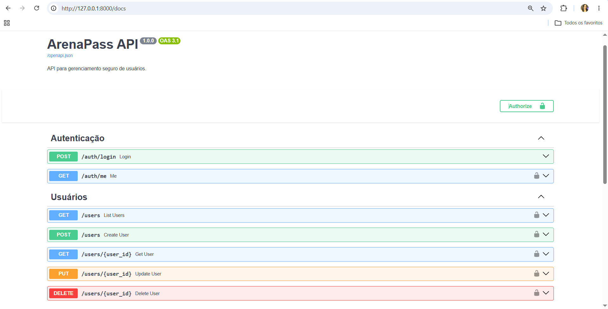
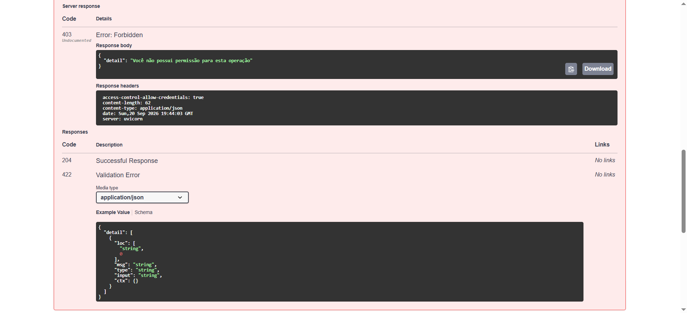

# ArenaPass

Sistema web para gerenciamento seguro de usuários, desenvolvido com uma API REST em FastAPI e uma interface web em React.

O ArenaPass utiliza autenticação por JWT e controle de acesso baseado em perfis (RBAC), permitindo que administradores, operadores e clientes tenham diferentes níveis de acesso à aplicação.

## Sobre o projeto

O ArenaPass simula uma plataforma utilizada por centros esportivos, academias e estúdios para gerenciamento de usuários e permissões de acesso.

O projeto foi desenvolvido com foco na aplicação prática de conceitos relacionados a:

- APIs REST
- Web Services
- Autenticação
- Autorização
- JWT
- RBAC
- Segurança de aplicações web
- Integração entre front-end e back-end

## Tecnologias

### Back-end

- Python
- FastAPI
- SQLAlchemy
- SQLite
- PyJWT
- bcrypt
- Pydantic

### Front-end

- React
- Vite
- JavaScript
- HTML
- CSS

### Versionamento

- Git
- GitHub

## Funcionalidades

O sistema permite:

- Autenticação de usuários
- Geração de token JWT
- Cadastro de usuários
- Listagem de usuários
- Consulta de usuário específico
- Atualização de usuários
- Exclusão de usuários
- Controle de acesso baseado em perfil
- Hash seguro de senhas
- Validação de dados
- Interface adaptada conforme o perfil do usuário

## Perfis de acesso

O ArenaPass possui três níveis de acesso.

| Funcionalidade | Administrador | Operador | Cliente |
|---|:---:|:---:|:---:|
| Fazer login | ✅ | ✅ | ✅ |
| Visualizar próprio perfil | ✅ | ✅ | ✅ |
| Listar usuários | ✅ | ✅ | ❌ |
| Consultar outros usuários | ✅ | ✅ | ❌ |
| Criar usuário | ✅ | ❌ | ❌ |
| Editar usuário | ✅ | ✅ | ❌ |
| Alterar perfil | ✅ | ❌ | ❌ |
| Excluir usuário | ✅ | ❌ | ❌ |

As permissões são verificadas pelo back-end. Portanto, mesmo que uma funcionalidade seja manipulada manualmente no front-end, a API continua protegendo o recurso.

## Arquitetura

```text
┌─────────────────┐
│      React      │
│   Front-end     │
└────────┬────────┘
         │
         │ HTTP / JSON
         ▼
┌─────────────────┐
│     FastAPI     │
│    API REST     │
├─────────────────┤
│ JWT + RBAC      │
│ bcrypt          │
│ Pydantic        │
└────────┬────────┘
         │
         ▼
┌─────────────────┐
│   SQLAlchemy    │
│     SQLite      │
└─────────────────┘
```

## Principais endpoints

| Método | Endpoint | Finalidade | Acesso |
|---|---|---|---|
| POST | `/auth/login` | Fazer login e gerar JWT | Público |
| GET | `/auth/me` | Consultar usuário autenticado | Autenticado |
| POST | `/users` | Cadastrar usuário | Administrador |
| GET | `/users` | Listar usuários | Administrador / Operador |
| GET | `/users/{id}` | Consultar usuário | Conforme perfil |
| PUT | `/users/{id}` | Atualizar usuário | Administrador / Operador |
| DELETE | `/users/{id}` | Excluir usuário | Administrador |

A documentação interativa completa da API também pode ser acessada pelo Swagger.

```text
http://127.0.0.1:8000/docs
```

## Autenticação

O login é realizado através do endpoint:

```http
POST /auth/login
```

Exemplo:

```json
{
  "email": "usuario@arenapass.com",
  "senha": "123456"
}
```

Quando as credenciais estão corretas, a API retorna um JWT:

```json
{
  "access_token": "TOKEN_JWT",
  "token_type": "bearer"
}
```

Nas requisições protegidas, o token é enviado no cabeçalho:

```http
Authorization: Bearer TOKEN_JWT
```

O token possui validade de **30 minutos**.

## Conteúdo do JWT

O token armazena somente informações necessárias para autenticação e autorização:

```json
{
  "sub": "1",
  "nome": "Usuário",
  "perfil": "administrador",
  "iat": 1789920000,
  "exp": 1789921800
}
```

A senha nunca é armazenada dentro do JWT.

## Segurança

Algumas medidas aplicadas no projeto:

- Senhas armazenadas utilizando hash com bcrypt
- JWT com tempo de expiração
- Chave de assinatura armazenada em variável de ambiente
- Controle de acesso RBAC aplicado no back-end
- Validação de dados com Pydantic
- Mensagem genérica para credenciais inválidas
- Proteção de endpoints com Bearer Token
- Diferenciação entre respostas `401 Unauthorized` e `403 Forbidden`

A aplicação utiliza `localStorage` para armazenar o JWT no front-end por simplicidade acadêmica. Em um ambiente de produção, outras estratégias, como cookies `HttpOnly`, podem ser consideradas para reduzir riscos relacionados a XSS.

## Estrutura do projeto

```text
arenapass/
│
├── backend/
│   ├── app/
│   │   ├── routes/
│   │   │   ├── auth.py
│   │   │   └── users.py
│   │   ├── __init__.py
│   │   ├── auth.py
│   │   ├── database.py
│   │   ├── main.py
│   │   ├── models.py
│   │   └── schemas.py
│   │
│   ├── create_admin.py
│   ├── .env.example
│   └── requirements.txt
│
├── frontend/
│   ├── src/
│   │   ├── pages/
│   │   │   ├── Dashboard.jsx
│   │   │   └── Login.jsx
│   │   ├── services/
│   │   │   └── api.js
│   │   ├── App.jsx
│   │   ├── index.css
│   │   └── main.jsx
│   │
│   └── package.json
│
├── docs/
│   └── DOCUMENTACAO.md
│
├── .gitignore
└── README.md
```

# Como executar

## Pré-requisitos

Para executar o projeto é necessário ter instalado:

- Python 3
- Node.js
- npm
- Git

## 1. Clone o repositório

```bash
git clone https://github.com/maycelestino/arenapass.git
```

Entre na pasta:

```bash
cd arenapass
```

## 2. Configure o back-end

Entre na pasta:

```bash
cd backend
```

Crie o ambiente virtual:

```bash
python -m venv .venv
```

No Windows PowerShell:

```powershell
.venv\Scripts\Activate.ps1
```

Instale as dependências:

```bash
python -m pip install -r requirements.txt
```

## 3. Configure a variável de ambiente

Crie um arquivo `.env` dentro de `backend`.

Exemplo:

```env
SECRET_KEY=sua-chave-secreta
```

O arquivo `.env` não deve ser enviado ao GitHub.

O projeto contém um `.env.example` como referência.

## 4. Crie o primeiro administrador

Execute:

```bash
python create_admin.py
```

Informe:

```text
Nome
E-mail
Senha
```

O usuário será criado automaticamente com o perfil:

```text
administrador
```

## 5. Execute a API

```bash
uvicorn app.main:app --reload
```

A API estará disponível em:

```text
http://127.0.0.1:8000
```

Swagger:

```text
http://127.0.0.1:8000/docs
```

## 6. Configure o front-end

Abra outro terminal e entre em:

```bash
cd frontend
```

Instale as dependências:

```bash
npm install
```

Execute:

```bash
npm run dev
```

A aplicação estará disponível em:

```text
http://localhost:5173
```

# Fluxo da aplicação

```text
Login
  ↓
Validação de e-mail e senha
  ↓
Geração do JWT
  ↓
Token enviado ao front-end
  ↓
Consulta do usuário autenticado
  ↓
Identificação do perfil
  ↓
┌──────────────────┬──────────────────┬─────────────────┐
│  Administrador   │     Operador     │     Cliente     │
│                  │                  │                 │
│ Gerencia usuários│ Consulta usuários│ Próprio perfil  │
│ Altera perfis    │ Edita usuários   │                 │
│ Exclui usuários  │                  │                 │
└──────────────────┴──────────────────┴─────────────────┘
```

# OAuth 2.0

O OAuth 2.0 não foi implementado nesta versão do ArenaPass.

Entretanto, uma aplicação parceira poderia utilizar um fluxo como **Authorization Code com PKCE** para solicitar acesso aos recursos protegidos sem precisar receber a senha do usuário.

Permissões poderiam ser organizadas através de escopos como:

```text
profile:read
users:read
```

Uma explicação mais detalhada está disponível em:

```text
docs/DOCUMENTACAO.md
```

# Códigos HTTP utilizados

| Código | Significado |
|---|---|
| `200` | Operação realizada com sucesso |
| `201` | Recurso criado |
| `204` | Recurso removido |
| `401` | Não autenticado |
| `403` | Sem permissão |
| `404` | Recurso não encontrado |
| `409` | Conflito, como e-mail já cadastrado |
| `422` | Dados inválidos |

# Documentação

A documentação acadêmica detalhada contendo:

- Modelagem da API
- Endpoints
- JWT
- RBAC
- OAuth 2.0
- Análise de segurança
- Códigos HTTP

está disponível em:

```text
docs/DOCUMENTACAO.md
```

# Demonstração

O ArenaPass possui uma interface web diferente conforme o nível de acesso do usuário.

### Administrador

Pode visualizar, cadastrar, editar e excluir usuários.

### Operador

Pode visualizar e editar usuários, sem acesso às funções administrativas.

### Cliente

Visualiza apenas os próprios dados.

--- 
### Página inicial


### Acesso como administrador


### Cadastro de novo usuário


### Acesso de operador


### Acesso de cliente


### Swagger / API REST


### Tentativa de exclusão de um cadsatro com o usuário operador


---

## Autor

**Mayara Celestino**

Projeto desenvolvido como aplicação acadêmica para estudo de APIs REST, autenticação, autorização e segurança de aplicações web.